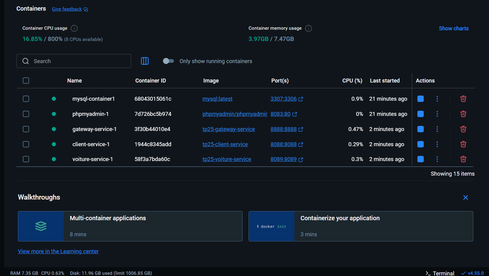
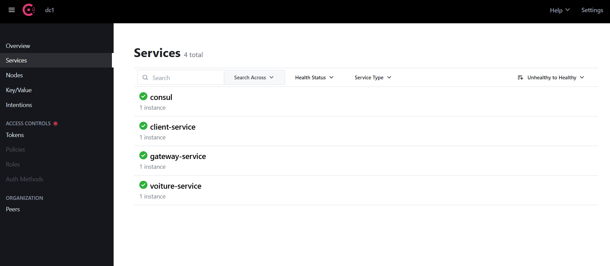
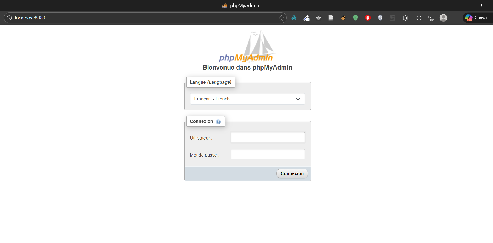

# 🐳 Microservices avec Docker + Consul

Architecture de microservices conteneurisée avec **Docker**, **Spring Boot**, et **Consul** pour la découverte de services.

## 📸 Screenshots





## 🏗️ Services

| Service             | Port | Description          |
| ------------------- | ---- | -------------------- |
| **Client Service**  | 8088 | Gestion des clients  |
| **Voiture Service** | 8089 | Gestion des voitures |
| **Gateway**         | 8888 | Point d'entrée API   |
| **Consul**          | 8500 | Service Discovery    |
| **MySQL**           | 3307 | Base de données      |
| **phpMyAdmin**      | 8083 | Interface DB         |

## 🛠️ Stack Technique

- **Spring Boot** + Java 17
- **Docker** + Docker Compose
- **Consul** - Service Discovery
- **MySQL** - Base de données
- **phpMyAdmin** - Administration DB

## 🚀 Démarrage

```bash
# Build et démarrer tous les services
docker compose up -d --build

# Vérifier le statut
docker compose ps

# Voir les logs d'un service
docker compose logs -f client-service
```

## 🔗 Accès

| URL                                       | Credentials                 |
| ----------------------------------------- | --------------------------- |
| [Consul Dashboard](http://localhost:8500) | -                           |
| [phpMyAdmin](http://localhost:8083)       | User: `root` / Pass: `root` |
| [Gateway API](http://localhost:8888)      | -                           |
| [Client Service](http://localhost:8088)   | -                           |
| [Voiture Service](http://localhost:8089)  | -                           |

## 🐛 Troubleshooting

- **Ports occupés**: MySQL utilise le port **3307** (au lieu de 3306), phpMyAdmin utilise **8083**
- **Enregistrement Consul**: Attendre ~1 minute pour que les services s'enregistrent
